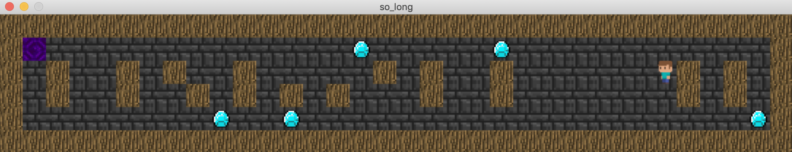

[](https://42seoul.kr/)
[![result](https://img.shields.io/badge/Success-115/100-5cb85c?style=flat-square&logoWidth=12&logo=data:image/png;base64,iVBORw0KGgoAAAANSUhEUgAAADAAAAAwCAYAAABXAvmHAAAAAXNSR0IArs4c6QAAAylJREFUaEPtmDmLVEEUhb+LK+IG7qIibuCKYCYYOSoGomjimoggOgiKmYGhgYEMGqgYiJmIG4ig4IKGitsv8Ae4m7ocuWO108u8flWvu+030JXN9Kmqc+49devWM0b4sBHOn56Abmewl4FeBnIiIGk6cBtYCxwzs2vVU0ptIUkzgEfAmkBawFEzu1QRUVoBgfxjYHVdklzEETO77P8vpYAm5CtafgMH3U6lEyBpJuCRX5VzPH4BB0olIJB/AqyMrG4fSiNA0izAya+IJO+wp6UQkGCbam3vgL6uCyhgGxfxl7zZx64KCLbxAxvr+RryXS2jBT3/L/JdvcjaRX7YDEhaBJwB3gOnzexHQlXIhUqa69UDWJYLHgK8DZ7/VD+n5gxIWgfcB7yk+bgF7DaznwmbZUIlzQ6XVEqpbLDNsM2cpI2h65tcx+AmsKdVEYG81/nlCcHwyG/yapM1ZzADkvYBV4ExGcAbwF4z8+s7eUiaF2yzJGFypm1qMiCpH7gQ0di5wENm5o1U9ChI/k3w/Oe8jUzSd2BSHjD8fgU4bGbe0uYOSfND5BfngocA0eR9igu4C2xP2OAi0J8nQtKC0NukkH8dPJ8b+QpfFzABeABsSBBxHjieJaJg5KM8X8+xcoinhPLmZTR2DJjZiXpwwcgXIj9ooQqB8Hh+ltjOnjOzk1VruG38kvLLMHYUJl8jwP8It+RzIMW3Z4FTYc5DYGEsc+BV8PyXhDk10IZuVJITcBFeQWLH11DJRsVOaAf5hgxUWWEp4Haak0AoBeql0m/Yht4mZZFMAcFO/jnD/TwtddEcfFKdz9u76YNGkn8NcxFT8xaK/L2t5JtmoMpO6wE/nBMjSWbB2k4+SkCwUx9wDxhfUETyDRu7T/SbWNI2wFvrsbGLB9xLYLOZeaVq+4gWEDKxFbgDjItk0rHIV/ZPEhBE7AD8fZD1dqis/QLY0qnIFxYQROwErjcR0fHItyQgR8R/Ix9dhbL8LmlXyMTogPHexg9sdD8feZYyYclnoH4lSW6ngfC5b7+ZfWuVVMr8lgWkbNYJbE9AJ6KasmYvAynR6gR2xGfgD5kpEElZbxKNAAAAAElFTkSuQmCC)](https://projects.intra.42.fr/so_long/mine)

# so_long

This project is a small 2D game with `MinilibX`. You'll learn about textures, sprites and tiles.
read the [subject](https://cdn.intra.42.fr/pdf/pdf/34990/en.subject.pdf) for more infrmetion
                                                                                                                           
|                      |                                                                                                                                     |
| -------------------- | ----------------------------------------------------------------------------------------------------------------------------------- |
| **Program name**     | `so_long`                                                                                                                           |
| **Makefile**         | `all`, `clean`, `fclean`, `re`, `bonus`, `test`, `debug`                                                                            |
| **Arguments**        | a map in format `*.ber`                                                                                                             |
| **External functs.** | - `open`, `close`, `read`, `write`, `printf`, `malloc`, `free`, `perror`, `strerror`, `exit` <br> - All functions of the `MinilibX` |
| **Libft authorized** | Yes                                                                                                                                 |
| **Description**      | a small 2D game where a player escapes map after eating some collects before leaving the place.                                     |

## Environment

- MacOS 11.4(Big Sur, Intel)

Developed and tested in this environment.

## Compile

### Mandatory

To compile the mandatory version, run the lines below.

```shell
$ git clone https://github.com/srngch/so_long
$ cd so_long
$ make all
```
### Bonus

To compile the bonus version,

```shell
$ git clone https://github.com/srngch/so_long
$ cd so_long
$ make bonus
```
or

```shell
$ git clone https://github.com/srngch/so_long
$ cd so_long_bonus
$ make 
```
## Execute

Run compiled executable file.

### Mandatory

```shell
$ ./so_long [map_filename]
```

### Bonus

$ ./so_long_bonus [map_filename]

### Controls

- `ESC` exit a game
- `WASD` to move

## Example


